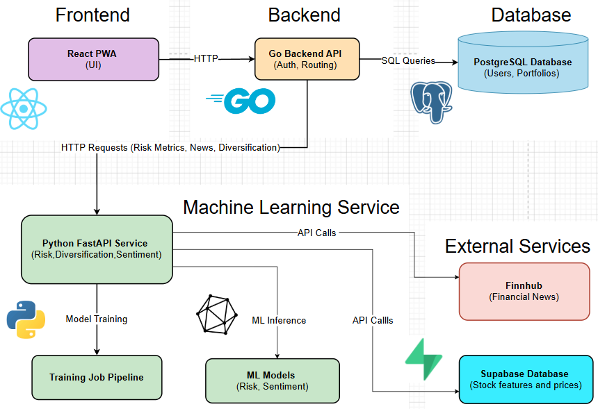

# Stock Wise

Stock Wise is a portfolio analytics application designed to help retail investors better understand their investments. It focuses on risk analysis, diversification, and performance insights using a combination of financial metrics and machine learning.

Screencast: [SharePoint video](https://atlantictu-my.sharepoint.com/:v:/g/personal/g00413791_atu_ie/IQBp8Dg70NoFSKE-GPQO3yASAWbmH8ZopOPoNubV4TIc58o?e=qva7d4)

---

## Project Overview

This project is built as a multi-service system consisting of four main components:

- **Frontend (React Native + Expo Web)** - user interface to interact with the application  
- **Backend API (Go + Iris)** -  handles requests, business logic, and database interaction  
- **ML Service (Python + FastAPI)** - performs financial analytics and machine learning tasks  
- **Database (PostgreSQL)** - stores portfolio and user data  

---

## Key Features

The application includes the following features:

- Portfolio management (add, update, delete, and view holdings)
- Risk analysis metrics:
  - Portfolio volatility  
  - Sharpe ratio  
  - Value at Risk (VaR)  
  - Maximum Drawdown (MDD)
- Machine learning-based stock risk categorisation
- Portfolio performance evaluation and comparison
- Diversification suggestions based on user risk preference
- Simulation of portfolio changes before applying them
- Financial news retrieval with sentiment analysis (positive, negative, neutral)

---

## System Architecture

- The frontend communicates with the Go backend via a REST API  
- The backend validates requests and interacts with PostgreSQL  
- The backend forwards analytics-related requests to the FastAPI service  
- The FastAPI service processes data using trained ML models and returns results  
- Results are sent back to the frontend for display  

## System Architecture Diagram

<p align="center">
  
</p>

---

## Tech Stack

- **Frontend:** React (Expo Web), TypeScript  
- **Backend:** Go (Iris framework)  
- **ML Service:** Python (FastAPI, scikit-learn, pandas, numpy)  
- **Database:** PostgreSQL  
- **Containerisation:** Docker & Docker Compose  

---

## Repository Structure

- `frontend/` – user interface  
- `backend/` – REST API and business logic  
- `services/` – ML models and FastAPI endpoints  

---

## Running the Project Locally

### Prerequisites

- Docker Desktop (or Docker Engine + Docker Compose v2+)

### Setup

1. Clone the repository:

```bash
git clone https://github.com/JenniferOji/StockWise
cd StockWise
```

2. Create your environment file from the example:

```bash
cp .env.example .env
```

3. Fill in the required values in `.env`.

### Running the Application

Start all services using Docker Compose:

```bash
docker-compose up --build
```

### Accessing the Application

| Service | URL |
|---|---|
| Frontend | http://localhost:3000 |
| Backend API | http://localhost:8080 |
| FastAPI (ML) | http://localhost:8000 |

To stop the application:

```bash
docker-compose down
```

---

## Deployment

The application is deployed across multiple platforms:

- **Frontend:** Vercel - https://stockwise-frontend-lovat.vercel.app/
- **Backend API:** Render  
- **ML Service (FastAPI):** Render  

